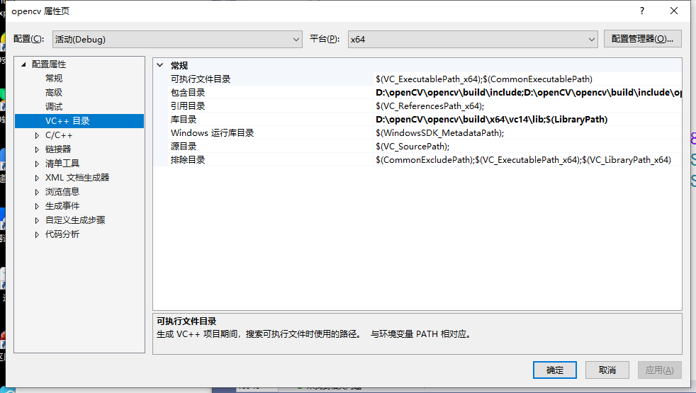

# 1 安装VS2019

# 2 下载安装Opencv

下载地址：https://opencv.org/releases/，当前下载的是4.3.0版本。

安装：选择任意一个盘符进行安装即可。


# 3 环境配置

- 配置系统变量`Path`，x64有两个文件夹，不是很清楚vc14和vc15的区别，先全部配上去：


- 使用VS2019创建一个C++空项目，打开项目->项目属性，==平台选择x64==：

  

  - VC++目录->包含目录：

    

  - VC++目录->库目录：

    

    

  - 链接器->输入->附加依赖项：opencv_world430d.lib（下载的4.3.0版本，如果是其他版本就作相应修改）

    

    # 4 测试

    按照3配置完成后，回到代码界面，将编译器改为==x64==，并测试以下代码：

    ```c++
    #include <opencv2/core/core.hpp>
    #include <opencv2/highgui/highgui.hpp>
    #include <opencv2/imgproc.hpp>
    #include <iostream>
    
    using namespace cv;
    using namespace std;
    
    int main()
    {
    	Mat image = Mat::zeros(300, 600, CV_8UC3);
    	circle(image, Point(300, 200), 100, Scalar(0, 255, 128), -100);
    	circle(image, Point(400, 200), 100, Scalar(255, 255, 255), -100);
    	imshow("Show Window", image);
    	waitKey(0);
    	return 0;
    }
    ```

    运行成功：

    

    

# 5 可能存在的问题

- Q1：程序编译成功，但是出现如下错误：缺乏opencv_world430d.dll...

  我的方法是将缺乏的dll文件复制到`C:\Windows\System32`文件夹下：


- Q2：是否每次创建一个新的项目都需要安装3重新配置？

  目前还没有去搜相关资料来解决，后续补充...