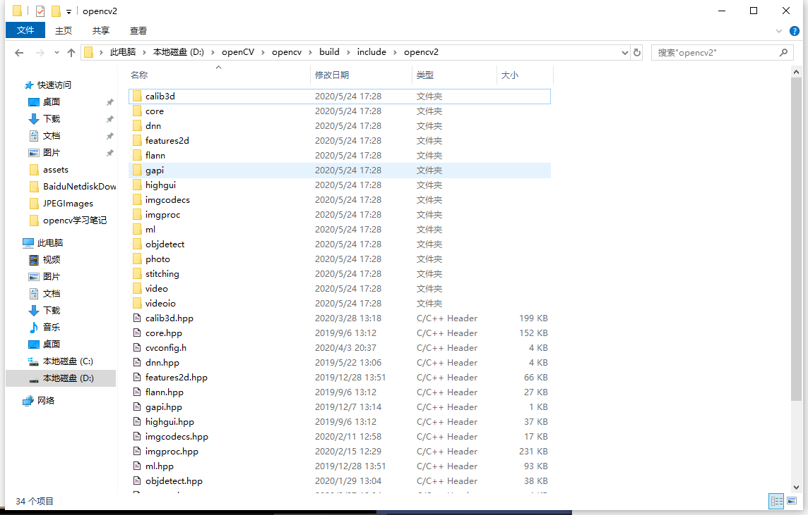
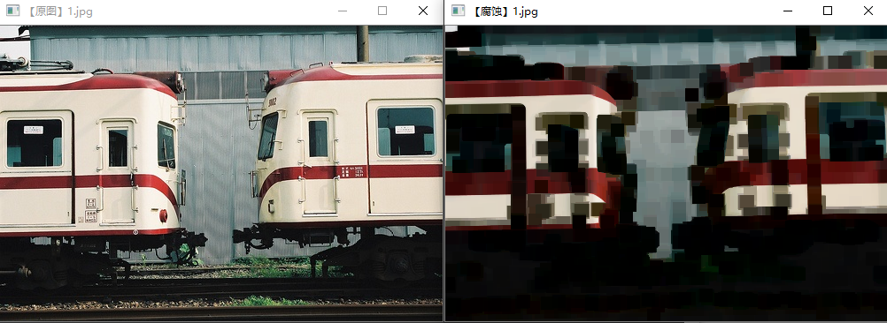
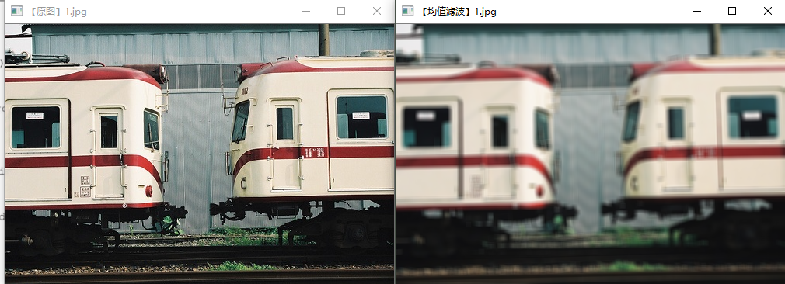
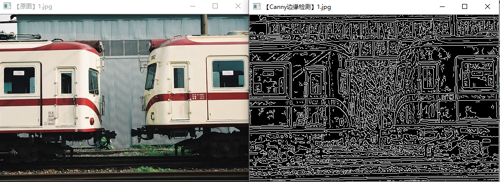

# 1 OpenCV的模块架构

打开`D:\openCV\opencv\build\include\opencv2`，可以看到OpenCV中包含的模块，在cpp中引入这些模块，就可以调用相关的函数对图像进行处理。



- calib3d：Calibration（校准）和3D这两个词的缩写，主要是相机校准和三维重建相关的内容。

- ==core==：核心功能模块，包含如下内容：
  - OpenCV基本数据结构
  - 动态数据结构
  - 绘图函数
  - 数组操作相关函数
  - 辅助功能和系统函数、宏
  - 与OpenGL的互操作

- dnn：深度学习相关算法
- features2d：2D功能框架，包含如下内容：
  - 特征检测和描述
  - 特征检测器（Feature Detectors）通用接口
  - 描述符提取器（Descriptor Extractors）通用接口
  - 描述符匹配器（Descriptor Matchers）通用接口
  - 通用描述符（Generic Descriptor）匹配器通用接口
  - 关键点绘制函数和匹配功能绘制函数

- flann：高维的近似近邻快速搜索算法库，包含KNN、聚类算法

- gapi：运用CPU和GPU加速的计算机视觉模块
- highgui：高层GUI图形用户界面，包含媒体的输入输出、视频捕捉、图像和视频的编码解码、图形交互界面的接口等内容
- imgcodecs：一些以前版本的代码库，保留下来作为向下兼容，包含如下内容：
  - 运动分析
  - 期望最大化
  - 直方图
  - 平面细分（C API）
  - 特征检测和描述
  - 描述符提取器的通用接口
  - 通用描述符的常用接口
  - 匹配器
- ml：机器学习模块
- objdetect：目标检测模块，包含Cascade Classification（级联分类）和Latent SVM这两部分
- photo：包含图像修复和图像去噪
- stitching：图像拼接模块，包含拼接流水线、特点寻找和匹配图像、估计旋转、自动校准、图片歪斜、接缝估测、曝光补偿、图片混合
- video：视频分析组件，包含运动估计、背景分离、对象跟踪等视频处理相关内容


# 2 快速入门

## 2.1 显示图像：imshow

在cpp中，图片的数据类型为`Mat`。

```c++
#include<opencv2/opencv.hpp> // 导入opencv的头文件
using namespace cv; // 包含cv命名空间

void main()
{
	Mat img = imread("./datasets/1.jpg");
	imshow("1.jpg", img);
	waitKey(0); // 显示图片的窗口一直显示，任意按键按下时关闭窗口
}
```


## 2.2 图像腐蚀：erode

`erode(Mat src_img, Mat dst_img, Mat element)`：腐蚀图像，返回到 dst_img

- src_img：原图
- dst_img：处理后的图像，需要先进行声明
- element：处理内核，使用`getStructuringElement`函数实现

`getStructuringElement(int shape, Size size)`： 返回指定形状和尺寸的结构元素（内核）

- shape：内核形状
  - MORPH_RECT：矩形
  - MORPH_CROSS：交叉形
  - MORPH_ELLTPSE：椭圆形
- size：内核尺寸

```c++
#include<opencv2/highgui/highgui.hpp>
#include<opencv2/imgproc/imgproc.hpp>
using namespace cv;

int main()
{
	Mat img = imread("./datasets/1.jpg");
	imshow("【原图】1.jpg", img);
	
	// 进行腐蚀操作
	Mat element = getStructuringElement(MORPH_RECT, Size(15, 15));
	Mat dstImage;
	erode(img, dstImage, element);

	imshow("【腐蚀】1.jpg", dstImage);
	waitKey(0);
	
	return 0;
}
```




## 2.3 均值滤波图像模糊：blur

`blur(Mat src_img, Mat dst_img, Size size)`：均值滤波模糊图像，返回到 dst_img

- Size：内核尺寸，使用该内核来对原图进行降噪

```c++
#include<opencv2/highgui/highgui.hpp>
#include<opencv2/imgproc/imgproc.hpp>

using namespace cv;

int main()
{
	Mat img = imread("./datasets/1.jpg");
	imshow("【原图】1.jpg", img);
	
	// 均值滤波法模糊图像
	Mat dstImage;
	blur(img, dstImage, Size(7, 7));
	imshow("【均值滤波】1.jpg", dstImage);
	waitKey(0);

	return 0;
}
```




## 2.4 边缘检测：Canny算法

### 2.4.1 Canny算法步骤

- （1）Canny算法通常处理的图像为灰度图，首先需要将彩色图片转换为灰度图；
- （2）消除噪声：对图像进行高斯滤波，就是根据待滤波的像素点及其邻域点的灰度值按照一定的参数规则进行加权平均。这样可以有效滤去理想图像中叠加的高频噪声；
- （3）使用梯度算子计算梯度，估计每一像素点处的边缘强度与方向；
- （4）根据梯度方向，对梯度幅值进行非极大值抑制。本质上是对Sobel、Prewitt等算子结果的进一步细化；
- （5）使用双阈值处理和连接边缘。

### 2.4.2 代码

- `vtColor(src_img, new_img, COLOR_BGR2GRAY)`：转换图像类型
  - COLOR_BGR2GRAY：转换为灰度图
  - COLOR_BGR2RGB：opencv默认读取的是BGR通道，通常需要转换为RGB通道
- `Canny(gray_img, edge, 3, 9, 3)`：

```c++
#include<opencv2/opencv.hpp>
#include<opencv2/imgproc/imgproc.hpp>

using namespace cv;

int main()
{
	Mat img = imread("./datasets/1.jpg");
	imshow("【原图】1.jpg", img);
	
	// 声明变量
	Mat dstImage, edge, grayImage;
	// 创建一个与原图同类型和大小的矩阵
	dstImage.create(img.size(), img.type());
	// 将原图转换为灰度图，结果存到grayImage中
	cvtColor(img, grayImage, COLOR_BGR2GRAY);
	// 使用3x3内核降噪，结果存到edge中
	GaussianBlur(grayImage, edge, Size(3, 3), 1.5);
	// 运行Canny算子
	Canny(edge, edge, 3, 9, 3);
	
	imshow("【Canny边缘检测】1.jpg", edge);
	waitKey(0);

	return 0;
}
```





## 2.5 视频操作

### 2.5.1 读取视频并播放视频

视频的数据类型为`VedioCapture`；

播放视频时需要读取并打开==每一帧==的图像

```c++
#include<opencv2/opencv.hpp>

using namespace cv;

int main()
{
	// 声明变量类型
	VideoCapture vedio;
	// 读取视频，存放在vedio中
	vedio.open("./datasets/1.avi");
    // 另一种写法： VideoCapture vedio("./datasets/1.avi")
    
	// 循环显示每一帧
	while (1)
	{
		Mat frame; // 定义一个Mat变量，存放每一帧图像
		vedio >> frame; // 读取当前帧图像
		imshow("1.avi", frame); // 显示当前图像
		waitKey(30); // 延时30s循环播放
	}

	return 0;
}
```

### 2.5.2 调用摄像头采集图像

将视频路径改为0；

在显示图像（imshow）之前，也可以对每一帧图片进行处理（调用相关图像算法），如Canny边缘检测

```c++
#include<opencv2/opencv.hpp>

using namespace cv;

int main()
{
	// 声明变量类型
	VideoCapture vedio(0);
	// 循环显示每一帧
	while (1)
	{
		Mat frame; // 定义一个Mat变量，存放每一帧图像
		vedio >> frame; // 读取当前帧图像
		imshow("调用摄像头", frame); // 显示当前图像
		waitKey(30); // 延时30s循环播放
	}

	return 0;
}
```